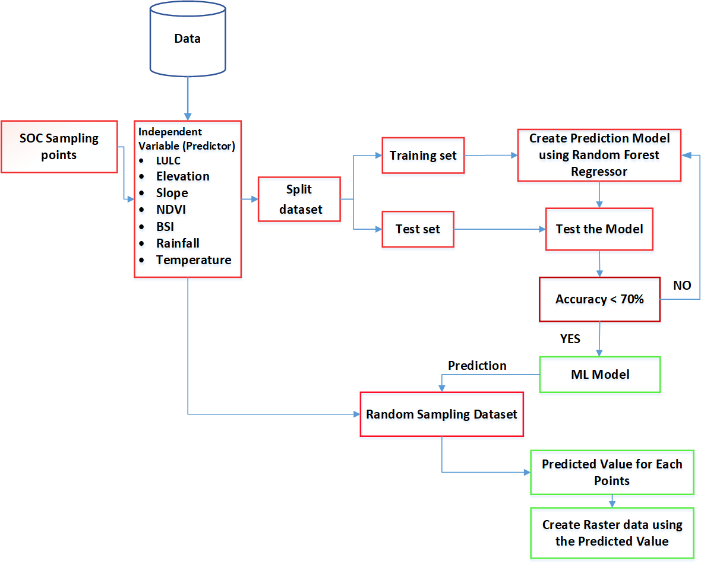

# **Soil Organic Carbon (SOC) Prediction for Mato Grosso, Brazil**

This project presents a spatial modeling framework for predicting **Soil Organic Carbon (SOC)** concentrations across **Mato Grosso, Brazil**, using machine learning techniques and Earth observation data. The study integrates field-sampled SOC data with environmental predictors extracted from **Google Earth Engine (GEE)** to build a Random Forest model over a large-scale area (\~**950,000 km²**), representing one of the most agriculturally dynamic regions of the Brazilian Cerrado.


## **Study Area**

**Mato Grosso** is a vast state in central-western Brazil and one of the most significant regions in the **Brazilian Cerrado biome**, known for its biodiversity and intense agricultural expansion. The area spans diverse land use patterns—from croplands and pastures to natural savannas—making it a vital landscape for studying carbon storage potential and land degradation. This work focuses on modeling SOC dynamics across the entire state (\~950,000 km²).


## **Workflow Architecture**

The pipeline integrates geospatial data processing, field validation, and model-driven prediction.




## **Methodology**

### 1. **Field Data Collection**

SOC values were collected from soil samples across representative sites in Mato Grosso. These values were geocoded and stored as point shapefiles (`sampling_points.shp`), covering various land use types.

### 2. **Predictor Variable Extraction (Google Earth Engine)**

Using **Google Earth Engine (GEE)**, multi-temporal and environmental predictor variables were extracted for the study area:

* **Land cover** (from MODIS and ESA datasets)
* **Topographic attributes** (elevation and slope from SRTM)
* **Climate data** (monthly temperature and precipitation)
* **Remote sensing indices**: NDVI (Normalized Difference Vegetation Index), BSI (Bare Soil Index)

All rasters were resampled to a uniform spatial resolution and aligned to the study grid.

### 3. **Modeling Approach**

* **Exploratory Data Analysis (EDA)** and **OLS regression** were first conducted to evaluate the relationships between SOC and environmental variables.
* A **Random Forest regression model** was trained using 70% of the sample data and validated on the remaining 30%.
* Key metrics: **R²**, **RMSE**, and **MAE** were computed to evaluate model performance.

### 4. **Prediction**

The trained model was applied to unsampled locations using the `predictive_dataset_label.shp` grid. Outputs were exported as:

* `predicted_data.csv` – SOC values for new locations
* `soc_pred.geojson` – Spatial map for visualization


## **Data Description**

| File                           | Description                                            |
| ------------------------------ | ------------------------------------------------------ |
| `sampling_points.shp`          | Georeferenced field SOC measurements                   |
| `Matto_Grosso.shp`             | Administrative boundary of the study area              |
| `predictive_dataset_label.shp` | Prediction grid with extracted variables for inference |


## **Results**

* The **Random Forest model** demonstrated high accuracy in predicting SOC distribution across the state.
* **Feature importance analysis** identified **NDVI, slope, rainfall**, and **elevation** as major contributors.
* The prediction provides a powerful visual and analytical tool for guiding land management and restoration strategies in the Cerrado.


## **Visual Outputs**

### **Land Use Map**


[Full Image](maps/landuse.jpg)

### **Terrain Map (Slope & Elevation)**


[Full Image](maps/Map1.jpg)

### **Remote Sensing Indices (NDVI and BSI)**


[Full Image](maps/Map3.jpg)

### **Climate Variables (Rainfall & Temperature)**


[Full Image](maps/map4.jpg)

### **Predicted SOC Map**


## **Usage**

1. Open the Jupyter Notebook `soc_prediction_v2.ipynb`.
2. Follow the steps from data loading, preprocessing, and exploratory analysis to model training and spatial prediction.
3. View and export results for further analysis or visualization in GIS platforms.

To clone this repository:

```bash
git clone https://github.com/sammygis/matto-grosso-soc-prediction.git
```


## **References**

1. **Nwaogu, C., Diagi, B.E., Ekweogu, C.V. et al.** (2024). *Soil organic carbon stocks as driven by land use in Mato Grosso State: the Brazilian Cerrado agricultural frontier.* **Discover Sustainability**, 5, 382. [https://doi.org/10.1007/s43621-024-00592-w](https://doi.org/10.1007/s43621-024-00592-w)

   > **This paper was published as a direct result of this research.**


## **Acknowledgments**

This work was inspired in part by [Hydroinformatics: Urban Flood Susceptibility Mapping](https://medium.com/hydroinformatics/towards-urban-flood-susceptibility-mapping-using-machine-and-deep-learning-models-3-random-9fe4e1279f3b), which guided the integration of Earth observation and machine learning.


